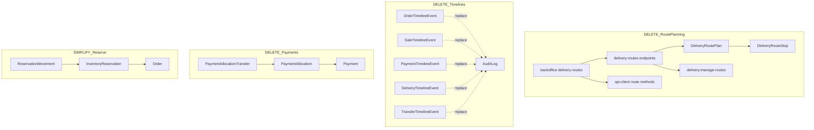

# Flower ERP — Cleanup Dependency Audit

**Status:** Stage A complete (audit only — no deletions applied)  
**Date:** 2026-07-29  
**Branch baseline:** `main` @ `5c2b4f1` (+ local OrderCalendarView build fix uncommitted)

This document inventories the monorepo before ERP simplification. Each item has a disposition:

| Status | Meaning |
|--------|---------|
| **KEEP** | Core business capability; retain as-is |
| **SIMPLIFY** | Keep capability; reduce model/UI/API complexity |
| **DELETE** | Remove full vertical slice (Stage B dead code, Stage C schema) |
| **NEEDS_REVIEW** | Decision blocked on product/usage; do not auto-delete |

Related: [database-cleanup-plan.md](./database-cleanup-plan.md), [scripts/audit-removable-data.sql](../scripts/audit-removable-data.sql)

---

## 1. Executive summary

### Target core (post-cleanup)

Single-store-first CRM/ERP with multi-store architecture preserved: identity, org/store/warehouse, customers, nomenclature, supply/receipts, inventory, orders, sales, payments, cash operations, simple delivery, basic reports/KPI, audit.

### Confirmed DELETE vertical slices (Stage C — after A+B)

| Slice | DB tables | API | UI |
|-------|-----------|-----|-----|
| Delivery route planning | `delivery_route_plans`, `delivery_route_stops` | `delivery-routes/*` | `delivery-routes/` |
| Payment allocation transfers | `payment_allocation_transfers` | `allocate-prepayments-to-sale`, transfer logic | none dedicated |
| Composition replacements entity | `order_composition_replacements` | `composition/replacements` | work-order replacement UI |
| Entity timeline tables (×5) | `*_timeline_events` | `*/timeline` endpoints | timeline panels |
| Reservation movement ledger | `reservation_movements` | reservation posting adapter | none |

### Confirmed DELETE / cleanup (Stage B — no schema)

| Item | Reason |
|------|--------|
| `app/sessions/page.tsx` | Orphan page; sessions managed via API/auth only |
| `today/page.tsx` | Redirect stub; links should point to calendar |
| Duplicate nav overlap | `home` + `operations` + `orders/calendar` — consolidate IA |
| `ExternalNavigationLinkAdapter` multi-stop routing | Stub; tied to route planning |
| ADR-only integration stubs | No runtime code for AI/Telegram/Kafka/Redis queues |

### NEEDS_REVIEW (do not auto-delete)

| Item | Question |
|------|------------|
| Cash shift (open/close/discrepancy) | Spec requires shift; schema has `CashAccount`/`CashOperation` only — no `CashShift` |
| Dedicated `/reports` module | Spec lists reports; only `analytics/operations` KPI partial coverage |
| `UnitOfMeasure` UI | Model + FK on `Item`; UI removed in prior commit — implicit «шт» |
| Delivery map/board/calendar | Rich UX beyond «simple delivery» — keep subset or merge? |
| `DeliveryProblem` workflow | Beyond simple statuses — keep for ops or simplify? |
| Separate `Recipient` entity | Spec mentions recipients; implemented as Order snapshots only |
| `GIFT_CERTIFICATE` payment method | Enum + UI exist; usage volume unknown |
| `SalesChannel.TELEGRAM` | Channel enum, not bot integration |

---

## 2. API modules (NestJS)

Registered in `apps/api/src/app.module.ts` (+ `PlatformModule` bundles auth/identity/audit).

| Module | Status | Reason | Key dependencies | Removal risk |
|--------|--------|--------|------------------|--------------|
| **platform** | KEEP | Auth, identity, audit query | Prisma, JWT | Critical |
| **auth** | KEEP | Login, refresh, sessions, password | User, Session | Critical |
| **identity** | KEEP | Users, roles, permissions | Permission registry | Critical |
| **organization** | KEEP | Org, store, warehouse, integration settings | Prisma org models | Critical |
| **master-data** | KEEP | Items, categories, suppliers, policies, retail prices | UnitOfMeasure, Item | Low |
| **supply** | KEEP | Supplies, goods receipts, posting | Inventory port | Critical |
| **inventory** | KEEP | Balances, batches, movements, write-offs, counts | Posting adapters | Critical |
| **orders** | SIMPLIFY | Core orders; drop replacements + order timeline | Inventory reservation, sales, delivery | Medium |
| **sales** | SIMPLIFY | Core sales; drop sale timeline | Inventory issue, payments | Medium |
| **payments** | SIMPLIFY | Core payments; drop allocation transfers + payment timeline | Cash operations, orders, sales | Medium |
| **delivery** | SIMPLIFY | Keep DeliveryJob; delete route planning slice | Orders, geocoding adapter | Medium |
| **transfers** | SIMPLIFY | Keep documents; drop transfer timeline | Inventory posting | Low |
| **analytics** | KEEP | Workspace, operations KPI, stock operational | Read repos across modules | Low |
| **system** | KEEP | Health live/ready | Prisma | Low |
| **infrastructure** | KEEP | Prisma, audit write, IDs | Shared | Critical |

No standalone modules found for: AI, Telegram, Kafka, RabbitMQ, Redis, webhooks, marketplace, public storefront.

---

## 3. API endpoints by controller

### 3.1 KEEP (core)

| Controller | Endpoints | Notes |
|------------|-----------|-------|
| `auth.controller` | login, refresh, logout, me, sessions, change-password | |
| `user.controller` | CRUD users, roles, store access | |
| `role.controller` | list roles | |
| `organization.controller` | org/store/warehouse CRUD, integration-settings | Geocoding config used |
| `master-data.controller` | suppliers, categories, policies, items, retail-prices | |
| `supply.controller` | supplies, receipts, post/reverse | |
| `inventory.controller` | inventory, batches, movements | |
| `write-offs.controller` | write-offs CRUD, post/reverse | |
| `inventory-counts.controller` | counts CRUD, post/cancel | |
| `customers.controller` | customers CRUD | |
| `orders.controller` | orders CRUD, board, confirm, reserve, assign, prepare, complete, cancel, comments | See SIMPLIFY rows |
| `sales.controller` | sales from order/direct, complete, annul, consumption | See SIMPLIFY rows |
| `payments.controller` | payments, refunds, methods, cash-accounts, cash-operations | See SIMPLIFY rows |
| `delivery.controller` | deliveries CRUD, couriers, board/map/calendar, geocode | See DELETE rows |
| `transfers.controller` | transfers CRUD, dispatch/receive/cancel | See SIMPLIFY rows |
| `workspace.controller` | workspace/today, operations, stock/operational | Director KPI |
| `audit.controller` | GET audit log | |
| `health.controller` | live, ready | |

### 3.2 SIMPLIFY (remove sub-endpoints in Stage C)

| Endpoint | Status | Replacement |
|----------|--------|-------------|
| `GET orders/:id/timeline` | DELETE | `AuditLog` + optional lightweight order feed |
| `POST orders/:id/composition/replacements` | DELETE | Actual composition + comment + approval flag |
| `GET sales/:id/timeline` | DELETE | AuditLog |
| `GET payments/:id/timeline` | DELETE | AuditLog |
| `GET deliveries/:id/timeline` | DELETE | AuditLog |
| `GET transfers/:id/timeline` | DELETE | AuditLog |
| `POST orders/:id/allocate-prepayments-to-sale` | SIMPLIFY | Direct allocation on payment create; no cross-order transfer |

### 3.3 DELETE (Stage C)

| Endpoint group | Permission | UI consumer |
|----------------|------------|-------------|
| `POST/GET delivery-routes/*` | `delivery:manage-routes` | `delivery-routes/page.tsx`, `[routeId]/page.tsx` |
| Route stop reorder/activate/complete | same | api-client `*DeliveryRoute*` |

---

## 4. Backoffice pages

Base path: `/organizations/[organizationId]/...`

### 4.1 Store-scoped pages

| Route | Status | Reason | Nav / inbound links |
|-------|--------|--------|---------------------|
| `stores/[storeId]/orders/calendar` | KEEP | Primary shift board (Kanban) | PRIMARY_NAV «Заказы», resolveStoreHomePath |
| `stores/[storeId]/orders` | SIMPLIFY | List view; calendar is primary | Linked from calendar |
| `stores/[storeId]/orders/[orderId]` | KEEP | Order card | Journey strip, calendar |
| `stores/[storeId]/work-orders/[orderId]` | KEEP | Florist prep / actual composition | home, attention-ui, journey |
| `stores/[storeId]/sales` | KEEP | Sales list | PRIMARY_NAV |
| `stores/[storeId]/sales/new` | KEEP | Walk-in sale | Nav shortcut |
| `stores/[storeId]/sales/[saleId]` | KEEP | Sale detail | |
| `stores/[storeId]/stock` | KEEP | Inventory balances | PRIMARY_NAV |
| `stores/[storeId]/supplies` | KEEP | Receipts/supplies | PRIMARY_NAV |
| `stores/[storeId]/supplies/[supplyId]` | KEEP | Supply detail | |
| `stores/[storeId]/supplies/.../receipts/[receiptId]` | KEEP | Goods receipt | |
| `stores/[storeId]/write-offs` | KEEP | Write-offs | Target nav «Списания» |
| `stores/[storeId]/write-offs/[writeOffId]` | KEEP | Write-off detail | |
| `stores/[storeId]/inventory-counts` | KEEP | Inventory counts | Target nav |
| `stores/[storeId]/inventory-counts/[id]` | KEEP | Count detail | |
| `stores/[storeId]/transfers` | KEEP | Transfers (admin) | Target nav admin |
| `stores/[storeId]/transfers/[transferId]` | KEEP | Transfer detail | |
| `stores/[storeId]/deliveries` | KEEP | Delivery list | PRIMARY_NAV |
| `stores/[storeId]/deliveries/[deliveryId]` | KEEP | Delivery detail | |
| `stores/[storeId]/deliveries/map` | NEEDS_REVIEW | Map view + geocoding | Linked from deliveries |
| `stores/[storeId]/deliveries/calendar` | NEEDS_REVIEW | Delivery calendar | Not in PRIMARY_NAV |
| `stores/[storeId]/delivery-routes` | DELETE | Route planning | Hidden; direct URL only |
| `stores/[storeId]/delivery-routes/[routeId]` | DELETE | Route detail | |
| `stores/[storeId]/payments` | KEEP | Finance hub | PRIMARY_NAV «Финансы» |
| `stores/[storeId]/payments/[paymentId]` | KEEP | Payment detail | |
| `stores/[storeId]/cash-accounts` | KEEP | Cash ledger | Target nav admin «Кассовые смены» partial |
| `stores/[storeId]/payment-methods` | KEEP | Payment methods config | Settings subtree |
| `stores/[storeId]/couriers` | KEEP | Courier profiles | Settings/admin |
| `stores/[storeId]/home` | SIMPLIFY | Director/courier overview; overlaps calendar | PRIMARY_NAV «Обзор» |
| `stores/[storeId]/operations` | SIMPLIFY | Director KPI board; overlaps home | Linked from home |
| `stores/[storeId]/today` | DELETE | Redirect only | Stale links in operations KPI cards |
| `stores/[storeId]/settings` | KEEP | Store settings | |
| `stores/[storeId]/page.tsx` | KEEP | Store landing | |
| `stores/[storeId]/warehouses/[warehouseId]/inventory` | KEEP | Warehouse-level stock | Admin |

### 4.2 Org-scoped pages

| Route | Status | Reason |
|-------|--------|--------|
| `organizations/page.tsx` | KEEP | Org picker |
| `organizations/[organizationId]/page.tsx` | SIMPLIFY | Hub; hide technical links from florists |
| `organizations/[organizationId]/customers` | KEEP | Customers |
| `organizations/[organizationId]/users` | KEEP | Settings / employees |
| `organizations/[organizationId]/roles` | KEEP | Admin roles |
| `organizations/[organizationId]/audit` | KEEP | Admin audit |
| `organizations/[organizationId]/integrations` | KEEP | Yandex geocoding API key |
| `organizations/[organizationId]/master-data/*` | KEEP | Nomenclature hub |
| `master-data/items`, `categories`, `suppliers`, `policies`, `retail-prices` | KEEP | Reference data |

### 4.3 Global / auth pages

| Route | Status | Reason |
|-------|--------|--------|
| `login`, `change-password` | KEEP | Auth |
| `page.tsx` (root) | KEEP | Redirect / landing |
| `sessions/page.tsx` | DELETE | No inbound nav links; duplicate of auth API |

### 4.4 Target navigation (Stage B)

**All users:** Сегодня (→ calendar), Заказы, Продажа, Клиенты, Остатки, Поступления, Списания, Инвентаризация, Отчёты, Настройки.

**Admin only:** Сотрудники, Магазины, Склады, Перемещения, Кассовые смены, Аудит.

Current `PRIMARY_NAV` (`apps/backoffice/src/lib/nav.ts`): Обзор, Заказы, Продажи, Остатки, Приёмки, Доставка, Финансы, Справочники, Настройки — requires realignment in Stage B.

---

## 5. Prisma models (69)

| Model | Table | Status | Reason | Depends on | Risk |
|-------|-------|--------|--------|------------|------|
| Organization | organizations | KEEP | Tenant root | — | — |
| OrganizationIntegrationSettings | organization_integration_settings | KEEP | Yandex geocoding | Organization | Low |
| Store | stores | KEEP | Multi-store | Organization | — |
| Warehouse | warehouses | KEEP | Multi-warehouse | Store | — |
| AuditLog | audit_logs | KEEP | Unified technical audit | Organization | — |
| Supplier | suppliers | KEEP | Master data | Organization | — |
| ItemCategory | item_categories | KEEP | Nomenclature | Organization | — |
| UnitOfMeasure | units_of_measure | NEEDS_REVIEW | FK on Item; no admin UI | Organization | Medium if removed |
| InventoryPolicy | inventory_policies | KEEP | Tracking rules | Organization | — |
| Item | items | KEEP | Nomenclature | Category, UoM, Policy | — |
| ItemRetailPrice | item_retail_prices | KEEP | Retail pricing | Item | — |
| Supply | supplies | KEEP | Procurement | Store, Supplier | — |
| SupplyItem | supply_items | KEEP | Supply lines | Supply, Item | — |
| GoodsReceipt | goods_receipts | KEEP | Posting | Supply | — |
| GoodsReceiptItem | goods_receipt_items | KEEP | Receipt lines | GoodsReceipt | — |
| InventoryBatch | inventory_batches | KEEP | Batches / COGS | Warehouse, Item | — |
| InventoryMovement | inventory_movements | KEEP | Ledger | Batch, Warehouse | — |
| InventoryBalance | inventory_balances | KEEP | On-hand | Warehouse, Item | — |
| PostingIdempotencyKey | posting_idempotency_keys | KEEP | Posting safety | — | Low |
| Customer | customers | KEEP | CRM | Organization | — |
| Order | orders | KEEP | Core document | Store, Customer | — |
| OrderComposition | order_compositions | KEEP | Planned BOM | Order | — |
| OrderCompositionItem | order_composition_items | KEEP | Planned lines | Composition, Item | — |
| ActualComposition | actual_compositions | KEEP | Actual BOM | Order | — |
| ActualCompositionItem | actual_composition_items | KEEP | Actual lines | ActualComposition | — |
| OrderAssignment | order_assignments | KEEP | Florist assignment | Order | — |
| OrderCompositionReplacement | order_composition_replacements | DELETE | Separate replacement entity | Order | Low if exported |
| OrderTimelineEvent | order_timeline_events | DELETE | Duplicate audit | Order | Medium history |
| OrderComment | order_comments | KEEP | Business comments | Order | — |
| InventoryReservation | inventory_reservations | KEEP | Simple reserve state | Order, Batch | — |
| ReservationMovement | reservation_movements | DELETE | Movement ledger | Reservation | Medium |
| WriteOffDocument | write_off_documents | KEEP | Write-offs | Store | — |
| WriteOffItem | write_off_items | KEEP | Write-off lines | WriteOff | — |
| InventoryCount | inventory_counts | KEEP | Stocktake | Warehouse | — |
| InventoryCountItem | inventory_count_items | KEEP | Count lines | InventoryCount | — |
| TransferDocument | transfer_documents | KEEP | Inter-store moves | Warehouses | — |
| TransferItem | transfer_items | KEEP | Transfer lines | Transfer | — |
| TransferAllocation | transfer_allocations | KEEP | Batch allocation | Transfer | — |
| TransferTimelineEvent | transfer_timeline_events | DELETE | Duplicate audit | Transfer | Low |
| Sale | sales | KEEP | Sales | Store, Order? | — |
| SaleLine | sale_lines | KEEP | Sale lines | Sale | — |
| SaleDiscount | sale_discounts | KEEP | Discounts | Sale | — |
| SaleInventoryConsumption | sale_inventory_consumptions | KEEP | COGS posting | Sale | — |
| SaleInventoryConsumptionLine | sale_inventory_consumption_lines | KEEP | Consumption lines | Consumption | — |
| SaleTimelineEvent | sale_timeline_events | DELETE | Duplicate audit | Sale | Low |
| SaleAnnulment | sale_annulments | KEEP | Annul audit | Sale | — |
| PaymentMethod | payment_methods | KEEP | Method catalog | Organization | — |
| Payment | payments | KEEP | Payments | Store | — |
| PaymentAllocation | payment_allocations | SIMPLIFY | Keep 1:1 order/sale link | Payment | Medium |
| PaymentAllocationTransfer | payment_allocation_transfers | DELETE | Cross-order transfer | Payment, Allocation | Medium if used |
| PaymentRefund | payment_refunds | KEEP | Refunds | Payment | — |
| PaymentTimelineEvent | payment_timeline_events | DELETE | Duplicate audit | Payment | Low |
| CashAccount | cash_accounts | KEEP | Cash register | Store | — |
| CashOperation | cash_operations | KEEP | Cash ledger | CashAccount | — |
| User | users | KEEP | Identity | — | — |
| OrganizationMembership | organization_memberships | KEEP | Org access | User, Org | — |
| Permission | permissions | KEEP | RBAC | — | — |
| Role | roles | KEEP | RBAC | Organization | — |
| RolePermission | role_permissions | KEEP | RBAC join | Role, Permission | — |
| MembershipRole | membership_roles | KEEP | RBAC join | Membership, Role | — |
| UserStoreAccess | user_store_access | KEEP | Store scope | Membership, Store | — |
| Session | sessions | KEEP | Auth sessions | User | — |
| DeliveryJob | delivery_jobs | KEEP | Simple delivery | Order, Store | — |
| DeliveryAssignment | delivery_assignments | KEEP | Courier history | DeliveryJob | — |
| DeliveryProblem | delivery_problems | NEEDS_REVIEW | Problem workflow | DeliveryJob | Low |
| DeliveryTimelineEvent | delivery_timeline_events | DELETE | Duplicate audit | DeliveryJob | Low |
| CourierProfile | courier_profiles | KEEP | Couriers | Membership | — |
| DeliveryRoutePlan | delivery_route_plans | DELETE | Route planning | Store, Courier | Low |
| DeliveryRouteStop | delivery_route_stops | DELETE | Route stops | RoutePlan, DeliveryJob | Low |

---

## 6. Prisma enums (58)

| Enum | Status | Notes |
|------|--------|-------|
| OrganizationStatus | KEEP | |
| StoreStatus | KEEP | |
| WarehouseStatus, WarehouseType | KEEP | |
| MasterDataStatus | KEEP | |
| ItemType | KEEP | FLOWER, MATERIAL, etc. |
| RetailPricingMode | KEEP | |
| TrackingMethod | KEEP | |
| SupplyStatus, GoodsReceiptStatus | KEEP | |
| InventoryBatchStatus, InventoryBatchSourceType | KEEP | |
| InventoryMovementType | KEEP | |
| OrderStatus, OrderType, OrderOccasion | KEEP | |
| CustomerStatus | KEEP | |
| OrderTimelineEventType | DELETE | With OrderTimelineEvent |
| CompositionReplacementReason | DELETE | With replacements |
| InventoryReservationStatus | KEEP | |
| ReservationMovementType | DELETE | With ReservationMovement |
| WriteOffStatus, WriteOffReason | KEEP | |
| InventoryCountStatus | KEEP | |
| TransferStatus | KEEP | |
| TransferTimelineEventType | DELETE | With TransferTimelineEvent |
| SaleType, SaleStatus, SalesChannel | KEEP | TELEGRAM channel NEEDS_REVIEW |
| DiscountType, DiscountReason | KEEP | |
| SaleInventorySourceType | KEEP | |
| SaleTimelineEventType | DELETE | |
| PaymentMethodType | KEEP | GIFT_CERTIFICATE NEEDS_REVIEW |
| PaymentType, PaymentDirection, PaymentStatus | KEEP | |
| PaymentAllocationTargetType | SIMPLIFY | ORDER/SALE only |
| PaymentRefundStatus | KEEP | |
| PaymentTimelineEventType | DELETE | |
| CashAccountType, CashAccountStatus | KEEP | |
| CashOperationType, CashOperationDirection | KEEP | |
| UserStatus, MembershipStatus, RoleStatus | KEEP | |
| StoreAccessMode, SessionStatus | KEEP | |
| DeliveryStatus | SIMPLIFY | Map to simple statuses for UX |
| DeliveryMethod | KEEP | |
| GeocodingStatus, AddressSource | KEEP | Geocoding in use |
| CourierStatus | KEEP | |
| DeliveryProblemType, DeliveryProblemStatus | NEEDS_REVIEW | |
| DeliveryTimelineEventType | DELETE | |
| RoutePlanStatus | DELETE | With route plans |

---

## 7. Permissions (73 codes)

Source: `packages/permissions/src/registry.ts`

### 7.1 KEEP (all core module permissions)

All permissions except those listed below remain **KEEP** for existing endpoints/pages.

### 7.2 DELETE (with route planning slice)

| Permission | Status | Reason |
|------------|--------|--------|
| `delivery:manage-routes` | DELETE | Route plan API/UI removed |

### 7.3 SIMPLIFY (wording or scope)

| Permission | Status | Reason |
|------------|--------|--------|
| `delivery:update` | SIMPLIFY | Remove «Plan deliveries» if route-less |
| `payments:create` | SIMPLIFY | «allocations» wording — 1:1 only |
| `workspace:read` | SIMPLIFY | Merge with calendar shift concept |
| `operations:read` | KEEP/SIMPLIFY | Becomes «Отчёты» partial |

No permissions found for: reservations UI, timeline, composition replacements, allocation transfers (uses existing payment/order permissions).

---

## 8. Packages / contracts

| Package | Status | Contents | Notes |
|---------|--------|----------|-------|
| `@flower/contracts` | KEEP | API_VERSION, error shapes, health types | Minimal |
| `@flower/api-client` | SIMPLIFY | HTTP client for all modules | Remove route/timeline/replacement methods in Stage C |
| `@flower/permissions` | SIMPLIFY | Permission registry | Remove manage-routes |
| `@flower/shared-kernel` | KEEP | Money helpers | |
| `@flower/config` | KEEP | Env config | |
| `@flower/ui` | KEEP | Shared UI | |

### api-client methods to DELETE (Stage C)

- `listDeliveryRoutes`, `getDeliveryRoute`, `createDeliveryRoute`, `addDeliveryRouteStops`, `reorderDeliveryRouteStops`, `activateDeliveryRoute`, `completeDeliveryRoute`, `cancelDeliveryRoute`
- `getOrderTimeline` (if exposed), `getSaleTimeline`, `getPaymentTimeline`, `getDeliveryTimeline`, `getTransferTimeline`
- Composition replacement POST helper
- Types: `DeliveryRoutePlanDto`, `DeliveryRouteStopDto`, `*TimelineDto`

---

## 9. Dependency map (DELETE slices)

---

## 10. Infrastructure

| Asset | Status | Reason |
|-------|--------|--------|
| `docker/docker-compose.dev.yml` | KEEP | Development |
| `docker-compose.production.yml` | KEEP | Production |
| `docker/docker-compose.prod.example.yml` | SIMPLIFY | Merge doc with production compose |
| `docker/api/Dockerfile` | KEEP | CI build |
| `apps/api/Dockerfile` | KEEP | Prod + migrate entry |
| `docker/backoffice/Dockerfile` vs `apps/backoffice/Dockerfile` | SIMPLIFY | Two paths — document canonical |
| `.github/workflows/ci.yml` | KEEP | |
| `.github/workflows/dependency-security.yml` | KEEP | |
| `apps/api/prisma/migrations/*` | KEEP | Never edit applied migrations |

No Docker services for Redis, Kafka, RabbitMQ in compose files (aligns with ADR-007).

---

## 11. Tests referencing DELETE candidates

| Area | Files (sample) |
|------|----------------|
| Route planning | `delivery.use-cases`, `prisma-delivery.repository`, `delivery-rules` |
| Timelines | order/sale/payment/transfer/delivery repositories |
| Replacements | `orders.controller` composition/replacements, work-order page |
| Allocation transfer | `payment.use-cases`, `payment-rules`, ADR-021 |
| Reservation movements | inventory posting adapter, order reserve flow |

Full test update planned for commit `test: update tests after project cleanup`.

---

## 12. Documentation impact

| Doc | Status |
|-----|--------|
| `docs/architecture/adr/030-manual-route-planning-v1.md` | DELETE or supersede |
| `docs/architecture/adr/021-order-prepayment-to-sale-allocation.md` | UPDATE after payment simplify |
| `docs/domain/*-flow.md` timeline sections | UPDATE |
| `docs/architecture/module-map.md` | UPDATE (catalog module deferred — no code) |
| `docs/architecture/adr/007-no-redis-or-queues-in-v1.md` | KEEP — confirms no queue cleanup needed |

---

## 13. Data loss risk register

Run `scripts/audit-removable-data.sql` before Stage C.

| Table | Risk if non-empty | Mitigation |
|-------|-------------------|------------|
| delivery_route_plans/stops | Active routes lost | Export; complete/cancel plans first |
| payment_allocation_transfers | Prepayment history lost | Export; finance sign-off |
| order_composition_replacements | Replacement audit lost | Export or migrate to comments |
| *_timeline_events | UI history lost | Backfill AuditLog or SQL dump |
| reservation_movements | Debug trail lost | Keep inventory_reservations |

---

## 14. Stage plan

| Stage | Scope | This run |
|-------|-------|----------|
| **A** | Audit docs | ✅ This file + SQL + DB plan |
| **B** | Dead UI/backend, nav, no Prisma drops | Next |
| **C** | Simplify delivery/payments/reserve/timelines/replacements + migration | After A+B review |

### Stage B candidate file deletions (preview)

- `apps/backoffice/app/sessions/page.tsx`
- `apps/backoffice/app/organizations/.../today/page.tsx` (after link fixes)
- `apps/backoffice/app/organizations/.../delivery-routes/**`
- Orphan components (verify with import graph before delete)

### Stage C Prisma drops (preview — 10 tables)

See [database-cleanup-plan.md](./database-cleanup-plan.md).

---

## 15. Business invariant checklist (post-cleanup)

| Rule | Current implementation | Action |
|------|------------------------|--------|
| Non-negative stock | InventoryBalance + posting rules | KEEP — verify tests |
| Reserve reduces available | InventoryReservation + movements | SIMPLIFY — drop movement table |
| Cancel releases reserve | order.use-cases cancel | KEEP |
| Sale consumes actual composition | sale complete + consumption | KEEP |
| Order without sale allowed | OrderStatus flow | KEEP |
| Walk-in sale without order | sales/direct | KEEP |
| Payment sum / debt | PaymentAllocation + summaries | SIMPLIFY |
| No silent cross-order payment | PaymentAllocationTransfer | DELETE |
| Multi-store org scope | organizationId on all docs | KEEP |
| Transfer two-warehouse | TransferDocument posting | KEEP |

---

## 16. Sign-off gate before Stage C

- [ ] Product owner confirms NEEDS_REVIEW items
- [ ] `audit-removable-data.sql` executed on staging
- [ ] Stage B builds green
- [ ] Backup procedure tested
- [ ] No `NEEDS_REVIEW` item marked DELETE without explicit approval
